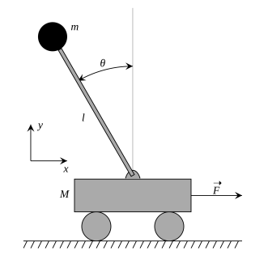

# InvertedPendulum

In this problem, I have designed a fuzzy controller in order to solve the inverted pendulum
problem. Our pendulum is located on a cart consists of a mass M at the top of a rod of length l
pivoted on a horizontally moving base. The rod is considered massless and is carrying a mass m. 
For implementing the fuzzy controller, I have written my code in inverted_pendulum.fcl
file which is a Fuzzy Control Language file. I have declared my needed inputs and outputs.
After that, there is a part to FUZZYFY and DEFUZZYFY the required variables, and at the end my fuzzy rules are in the RULEBLOCK section. 
After every run, the code gets a report from the system that contains charts from x (cart position),
x_dot (cart velocity), x_dot_dot (cart acceleration), theta - 180 (pendulum degree),
theta_dot (pendulum angular velocity), theta_dot_dot (pendulum angular acceleration), and
f (force applied to the cart). 
Note that theta starts from the bottom of the unit circle and goes on the counterclockwise circle.
Therefore, theta value is always 90 degrees more than that of the unit circle.
Stable state: a state in which the pendulum degree, pendulum angular velocity, pendulum angular
acceleration, cart acceleration, and force applied to the cart equal to 0. 
In summary, I have designed the fuzzy controller so that the inverted pendulum stay at a stable state for enough
time started from a random state that every variable except the pendulum degree is 0.
 

